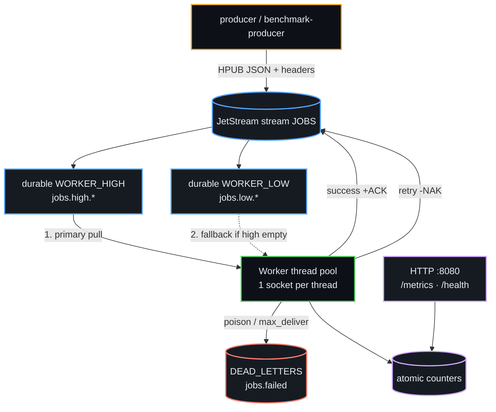

<p align="center">
  
</p>

<p align="center">
  <a href="https://github.com/amafjarkasi/tachyon/actions/workflows/ci.yml"></a>
  <a href="https://github.com/amafjarkasi/tachyon/releases/tag/v0.2.0"></a>
  <a href="https://ziglang.org/"></a>
  <a href="https://docs.nats.io/nats-concepts/jetstream"></a>
  <a href="LICENSE"></a>
  <a href="CHANGELOG.md"></a>
  <a href="https://github.com/amafjarkasi/tachyon/stargazers"></a>
</p>

# Tachyon

**Tachyon** is a zero-dependency, ultra-high-performance **background job processing library** built natively in **Zig 0.16.0** and powered by the **NATS JetStream** protocol.

Engineered for low-latency, mission-critical systems — financial clearing, telemetry ingest, notification pipelines, crawlers, and other microsecond-sensitive workers — it completely bypasses heavy runtimes, garbage collectors, and third-party frameworks. Tachyon speaks raw NATS over a hand-rolled TCP/TLS client, pulls work through durable JetStream consumers, and runs a multi-threaded pool with **per-thread socket isolation** and **zero-allocation arena reuse**.

<p align="center">
  
  
  
  
</p>

### Why teams pick Tachyon

<table>
  <tr>
    <td align="center" width="33%">
      <strong>⚡ Zig edge</strong><br/>
      Deterministic native code, no GC pauses, full control of every byte on the hot path
    </td>
    <td align="center" width="33%">
      <strong>📡 JetStream native</strong><br/>
      Durable streams, pull consumers, priority subjects, explicit ACK / NAK
    </td>
    <td align="center" width="33%">
      <strong>🔒 Zero deps</strong><br/>
      Only the Zig standard library — no crates, no npm, no Redis sidecar
    </td>
  </tr>
  <tr>
    <td align="center" width="33%">
      <strong>🧵 Socket isolation</strong><br/>
      One NATS connection per worker thread — no shared-socket mutex
    </td>
    <td align="center" width="33%">
      <strong>♻️ Arena reuse</strong><br/>
      <code>arena.reset(.retain_capacity)</code> keeps memory flat under load
    </td>
    <td align="center" width="33%">
      <strong>🛡️ Production resilience</strong><br/>
      Retries, DLQ, circuit breaker, timeouts, dedup, graceful SIGTERM drain
    </td>
  </tr>
</table>

### What you get out of the box

- **Throughput** — ~**74–92k jobs/sec** peak consume · ~**54k+/sec** produce (local loopback, ReleaseFast; single-consumer bench)  
- **Memory** — **&lt; 1 MB** idle · **&lt; 5 MB** peak with flat arena reuse  
- **Delivery** — explicit `+ACK` · **NAK + exponential backoff** · `max_deliver` · JetStream **DLQ**  
- **Correct retries** — **HMSG** / `Nats-Delivery-Count` · `+WPI` progress · `+TERM` when exhausted  
- **Ops** — `/health` · Prometheus `/metrics` · structured JSON logs · SLA latency warnings  
- **Restarts** — Windows Ctrl+C · POSIX **SIGINT / SIGTERM** graceful worker drain  
- **Config** — CLI · env · `config.json` · Docker · systemd · Kubernetes  

> **[v0.2.0](https://github.com/amafjarkasi/tachyon/releases/tag/v0.2.0)** — HMSG headers, real delivery-count retries, soft job timeouts, in-process dedup, circuit breaker, buffered batch ACK, auto-created `DEAD_LETTERS` stream.  
> Full notes → [CHANGELOG.md](CHANGELOG.md)

<p align="center">
  <a href="#-quick-start"><strong>Quick Start</strong></a> ·
  <a href="#-features">Features</a> ·
  <a href="#️-architecture">Architecture</a> ·
  <a href="#-performance">Performance</a> ·
  <a href="#-configuration">Configuration</a> ·
  <a href="#-production">Production</a> ·
  <a href="#-troubleshooting">Troubleshooting</a>
</p>

---

## Table of Contents

- [Why teams pick Tachyon](#why-teams-pick-tachyon)
- [What you get out of the box](#what-you-get-out-of-the-box)
- [Quick Start](#-quick-start)
- [Real usage recipes](#-real-usage-recipes)
- [Features](#-features)
- [Architecture](#️-architecture)
- [Performance](#-performance)
- [Binaries](#-binaries)
- [Configuration](#-configuration)
- [Job payload &amp; handler](#-job-payload--handler)
- [Observability](#-observability)
- [Resilience model](#-resilience-model)
- [Real-World Use Case Patterns](#-real-world-use-case-patterns)
- [Detailed Usage Examples](#-detailed-usage-examples)
- [Production](#-production)
- [Troubleshooting](#-troubleshooting)
- [Project layout](#-project-layout)
- [Contributing](#-contributing)
- [Changelog](#-changelog)
- [License](#-license)

---

## 🏁 Performance

Latest measured peaks (Windows + NATS 2.10, `ReleaseFast`, **200,000** unique jobs, batch 400, dedup off, timeouts off, ACK flush 128, prefetch, adaptive expires, **`single_consumer_mode`**, 100% high-priority subjects):

| Config | Consume peak (worker log) | Notes |
| :--- | ---: | :--- |
| **4 threads** (JSON on) | **~92k/s** | Best peak on this machine |
| **8 threads** (JSON on) | **~74k/s** | More contention, still strong |
| **8 threads** (`bench_skip_json`) | **~80k/s** | Pull/ACK ceiling without JSON |

Earlier dual-priority (80/20 high/low) full-drain runs hit ~**62–65k/s** peaks with complete 150k drain. Produce (single connection, buffered flush) is ~**54k/s**.

Comparative order-of-magnitude (other stacks from earlier published benches — not same hardware run):

| | **Tachyon** | Rust · tokio-nats | Go · nats.go | Node · BullMQ | Python · Celery |
| :--- | :---: | :---: | :---: | :---: | :---: |
| **Consume (order)** | **~74–92k/s peak** | ~80–86k/s | ~65k/s | ~8k/s | ~2k/s |
| **Idle RAM** | **&lt; 1 MB** | ~4 MB | ~15 MB | ~74 MB | ~110 MB |
| **Peak RAM** | **&lt; 5 MB** | ~12 MB | ~48 MB | ~98 MB | ~145 MB |
| **Sidecars** | **None** | — | — | Redis | RabbitMQ |

<details>
<summary><strong>Why it is fast</strong></summary>

1. **No garbage collection** — no stop-the-world pauses on the consume path.  
2. **Reused `msg_arena`** — no per-message Arena init/deinit.  
3. **Socket isolation** — each worker thread owns its NATS connection.  
4. **Fast-path `ackBuffered`** + flush every N (`ack_flush_every`).  
5. **Pull prefetch** — next `requestNext` mid-batch to hide RTT.  
6. **Adaptive pull expires** — long when busy, short when empty.  
7. **64KB TCP buffers** + optional `single_consumer_mode` / `bench_skip_json`.

</details>

> **Note:** Local loopback. Production latency is dominated by your `processJob` (SMTP/HTTP/DB). Use `dedup_cache_size`, rate limits, and timeouts for real workloads. For microbenches: `SINGLE_CONSUMER_MODE=true`, `DEDUP_CACHE_SIZE=0`, `BENCH_SKIP_JSON=true`.

---

## 🚀 Quick Start

### Prerequisites

- [Zig 0.16.0](https://ziglang.org/download/)
- [NATS Server](https://docs.nats.io/running-a-nats-service/introduction/installation) with JetStream (`nats-server -js`)

### 1. Start NATS

```bash
nats-server -js
```

### 2. Build

```bash
git clone https://github.com/amafjarkasi/tachyon.git
cd tachyon
zig build -Doptimize=ReleaseFast
```

Binaries land in `zig-out/bin/` (`worker`, `producer`, `benchmark-producer`).

### 3. Run a worker

```bash
# optional: copy and edit config
cp config.json.example config.json

zig build run-worker -Doptimize=ReleaseFast -- --threads 4 --batch 100
```

### 4. Enqueue work

```bash
# single demo job
zig build run-producer

# or flood for a throughput check
zig build run-benchmark-producer -Doptimize=ReleaseFast -- --jobs 50000
```

### 5. Probe health & metrics

```bash
curl -s http://127.0.0.1:8080/health
curl -s http://127.0.0.1:8080/metrics
```

```prometheus
# HELP zig_jobs_processed_total Total number of jobs processed.
# TYPE zig_jobs_processed_total counter
zig_jobs_processed_total 50000
# HELP zig_jobs_failed_total Total number of jobs failed / dead-lettered.
# TYPE zig_jobs_failed_total counter
zig_jobs_failed_total 0
```

### Expected worker log shape

```json
{"level":"info","message":"Successfully loaded configuration from config.json"}
{"level":"info","message":"Initializing NATS JetStream Stream & Consumers..."}
{"level":"info","message":"Metrics Server listening on http://127.0.0.1:8080 (/metrics, /health)"}
{"level":"info","message":"Spawning worker threads..."}
{"level":"info","thread_id":1,"message":"Processing job id=job_12345 to=hello@example.com subject=Welcome to Antigravity!"}
{"level":"info","message":"Throughput: 1 jobs/sec | Avg: 1.00 | Active: 4 | Failed: 0"}
```

---

## 📘 Real usage recipes

These are **runnable** workflows against a live `nats-server -js`. They use the shipped binaries — no extra code required.

### Recipe A — Hello world (single job)

```bash
# terminal 1
nats-server -js

# terminal 2
zig build -Doptimize=ReleaseFast
zig build run-worker -Doptimize=ReleaseFast -- --threads 2 --batch 10

# terminal 3
zig build run-producer -Doptimize=ReleaseFast
curl -s http://127.0.0.1:8080/metrics | grep zig_jobs_processed_total
# expect: zig_jobs_processed_total 1
```

What happens:

1. Worker creates stream `JOBS` + consumers `WORKER_HIGH` / `WORKER_LOW` + DLQ stream `DEAD_LETTERS`.  
2. Producer HPUB-publishes one JSON job to `jobs.high.email` with `Nats-Msg-Id`.  
3. A worker thread pulls, parses, runs `processJob` in `src/job.zig`, then `+ACK`s.  
4. Metrics counter increments; structured JSON logs show the job id.

### Recipe B — Throughput smoke test

```bash
zig build run-worker -Doptimize=ReleaseFast -- --threads 4 --batch 100
zig build run-benchmark-producer -Doptimize=ReleaseFast -- --jobs 100000
```

Watch the worker print:

```text
Throughput: NNNNN jobs/sec | Avg: … | Active: 4 | Failed: 0
```

Tips:

- Auto-scale kicks in above **~30k jobs/sec** (spawns up to 8 threads).  
- 80% of benchmark jobs go to `jobs.high.*`, 20% to `jobs.low.*`.  
- For max numbers use `ReleaseFast` and a quiet machine.

### Recipe C — Config + env overrides (staging-like)

```bash
cp config.json.example config.json
# edit config.json: worker_threads, stream_name, max_deliver, job_timeout_ms, …

export NATS_HOST=127.0.0.1
export NATS_PORT=4222
export MAX_DELIVER=8
export JOB_TIMEOUT_MS=3000
export MAX_JOBS_PER_SECOND=500   # optional throttle

zig build run-worker -Doptimize=ReleaseFast -- --threads 6 --batch 50
```

Precedence: **CLI > env > config.json > defaults**.

### Recipe D — Docker worker

```bash
docker build -t tachyon:0.2.0 .
docker run --rm --network host \
  -e NATS_HOST=127.0.0.1 \
  -e NATS_PORT=4222 \
  -p 8080:8080 \
  tachyon:0.2.0
```

Then produce from the host:

```bash
zig build run-producer -Doptimize=ReleaseFast
curl -s http://127.0.0.1:8080/health   # ok
```

### Recipe E — Inspect the DLQ after a poison message

Publish invalid JSON (not a Tachyon Job object) so the worker routes it to the DLQ:

```bash
# requires NATS CLI: https://github.com/nats-io/natscli
nats pub jobs.high.email '{"not":"a-valid-job"}'

# worker logs: Job parsing failed. Routing to DLQ.
nats stream ls
nats stream view DEAD_LETTERS
# or: nats sub jobs.failed
```

Poison messages are **`+TERM`**ed (not retried). Handler failures with valid JSON use **`-NAK` + backoff** until `max_deliver`, then DLQ + TERM.

### Recipe F — Custom domain handler

1. Edit [`src/job.zig`](src/job.zig) — replace the body of `processJob` with your SMTP / HTTP / DB call.  
2. Rebuild: `zig build -Doptimize=ReleaseFast`  
3. Keep the default JSON shape (`id`, `email`, `subject`, `body`) **or** change both the producer payload and the `Job` struct together.  
4. Return `error.Timeout` or any error to exercise NAK retry; invalid JSON still goes straight to DLQ.

```zig
// src/job.zig — minimal real-ish handler sketch
pub fn processJob(job: Job, thread_id: usize, timeout_ms: u32, io: std.Io, progress: ?*const fn () void) !void {
    _ = timeout_ms;
    _ = progress;
    // e.g. call your mailer / HTTP client here
    logging.logJSON("info", thread_id, job.id);
    // try sendEmail(io, job.email, job.subject, job.body);
}
```

### Recipe G — Graceful shutdown

```bash
# Linux / macOS
kill -TERM $(pgrep -f 'zig-out/bin/worker')

# Windows
# Ctrl+C in the worker console
```

Workers finish the in-flight job, stop pulling, and exit. Metrics server drains with them. Prefer `SIGTERM` over `SIGKILL` so JetStream does not redeliver mid-ACK races unnecessarily.

---

## ✨ Features

### Core runtime

| Feature | Detail |
| :--- | :--- |
| **Per-thread NATS sockets** | No shared connection, no mutex on the hot path |
| **Elastic auto-scaling** | Spawns up to 8 threads when throughput &gt; 30k/s; drains when &lt; 5k/s |
| **Arena reuse** | `ArenaAllocator` + `reset(.retain_capacity)` — flat memory |
| **Adaptive batching** | Shrinks pull batch when avg latency &gt; 200 ms; grows when &lt; 50 ms |
| **Priority routing** | Pull `WORKER_HIGH` first; fall back to `WORKER_LOW` when empty |
| **Hierarchical config** | CLI → env → `config.json` → defaults |

### Reliability (v0.2)

| Feature | Detail |
| :--- | :--- |
| **HMSG / HPUB headers** | Full NATS header frames; `Nats-Delivery-Count` for real attempt # |
| **NAK + exponential backoff** | `-NAK {"delay":…}` with `retry_base_ms` / `retry_max_ms` |
| **`max_deliver`** | Consumer redelivery cap; then DLQ + `+TERM` |
| **Soft job timeout** | `job_timeout_ms` — NACK if wall clock exceeded |
| **In-progress ACK** | `+WPI` extends JetStream `ack_wait` during work |
| **Job dedup** | Per-thread `job.id` cache (`dedup_cache_size`) |
| **Circuit breaker** | Opens after consecutive failures; half-open probe |
| **Buffered batch ACK** | `ackBuffered` + single `flushWrites` per pull batch |
| **JetStream DLQ** | Auto-creates `DEAD_LETTERS` stream on `jobs.failed` |
| **Reconnect + jitter** | Exponential backoff with ±25% jitter (no thundering herd) |

### Operations

| Feature | Detail |
| :--- | :--- |
| **`/health`** | Kubernetes liveness/readiness (`ok`) |
| **`/metrics`** | Prometheus counters (processed + failed) |
| **Structured JSON logs** | `{"level","thread_id","message"}` |
| **SLA alerts** | `warn` when a single job exceeds 500 ms |
| **Graceful shutdown** | Windows Ctrl+C · POSIX `SIGINT`/`SIGTERM` |
| **TLS + auth** | `std.crypto.tls.Client`, CONNECT user/pass |
| **Docker** | Multi-stage `Dockerfile`, non-root runtime |

### Feature deep-dives

<details>
<summary><strong>1. Socket-isolated workers</strong></summary>

Each OS thread owns a dedicated `NatsClient` and TCP (or TLS) connection. Pull, process, and ACK never contend on a shared socket mutex — throughput scales with cores until NATS or the job handler saturates.

</details>

<details>
<summary><strong>2. Priority queues</strong></summary>

Two durable pull consumers:

- `WORKER_HIGH` → `jobs.high.*`
- `WORKER_LOW` → `jobs.low.*`

Every loop iteration requests high first; only on empty/status does it pull low. Stream and consumer names are fully configurable.

</details>

<details>
<summary><strong>3. Retry &amp; dead letter</strong></summary>

```text
parse fail  ──► publish DLQ ──► +TERM
handler fail ──► if attempt < max_deliver ──► -NAK (backoff)
              └► else ──► publish DLQ ──► +TERM
success     ──► +ACK  (+ optional batch flush)
```

Backoff: `min(base_ms × 2^(attempt-1), max_ms)` converted to nanoseconds for JetStream.

</details>

<details>
<summary><strong>4. Headers (HMSG)</strong></summary>

`readMsg` understands both classic `MSG` and header-bearing `HMSG`. Status frames (`NATS/1.0 404 No Messages`) set `Msg.is_status`. Producers can attach headers via `publishWithHeaders` (e.g. `Nats-Msg-Id` for broker-side dedup).

</details>

<details>
<summary><strong>5. Circuit breaker</strong></summary>

After `circuit_failure_threshold` consecutive failures the worker **opens**: new jobs are NACKed without invoking the handler for `circuit_open_ms`, then **half-open** probes a single job. Success closes the circuit.

</details>

---

## 🏗️ Architecture



### Hot path (per job)

1. `requestNext` pull batch from high (then low) consumer  
2. `readMsg` → parse `MSG`/`HMSG`, extract `delivery_count`  
3. Circuit check → JSON parse → dedup by `job.id`  
4. `+WPI` → `processJob` in `src/job.zig` (your domain logic)  
5. Success → buffered `+ACK` · Failure → `-NAK` or DLQ + `+TERM`  
6. Batch end → `flushWrites` · adaptive batch size update  

---

## 📦 Binaries

| Binary | Command | Role |
| :--- | :--- | :--- |
| **worker** | `zig build run-worker -- [flags]` | Production consumer pool |
| **producer** | `zig build run-producer` | Single-job enqueuer (HPUB + `Nats-Msg-Id`) |
| **benchmark-producer** | `zig build run-benchmark-producer -- --jobs N` | Stress publisher (80% high / 20% low) |

```bash
worker --help
#  -t, --threads <n>   concurrent workers (default 4)
#  -b, --batch <n>     pull batch size   (default 50)
#  -h, --help
```

---

## ⚙️ Configuration

**Precedence (highest wins):**

```text
CLI flags  >  environment variables  >  config.json  >  built-in defaults
```

### `config.json`

Copy [`config.json.example`](config.json.example):

```json
{
    "nats_host": "127.0.0.1",
    "nats_port": 4222,
    "nats_user": null,
    "nats_pass": null,
    "nats_tls": false,
    "nats_ca_path": null,
    "worker_threads": 4,
    "worker_batch": 100,
    "stream_name": "JOBS",
    "consumer_high": "WORKER_HIGH",
    "consumer_low": "WORKER_LOW",
    "subject_high": "jobs.high.*",
    "subject_low": "jobs.low.*",
    "dlq_subject": "jobs.failed",
    "dlq_stream": "DEAD_LETTERS",
    "max_deliver": 5,
    "retry_base_ms": 1000,
    "retry_max_ms": 30000,
    "job_ttl_seconds": 0,
    "max_jobs_per_second": 0,
    "job_timeout_ms": 5000,
    "dedup_cache_size": 10000,
    "circuit_failure_threshold": 10,
    "circuit_open_ms": 5000,
    "batch_ack": true,
    "pull_expires_ns": 1000000000,
    "pull_expires_empty_ns": 50000000,
    "bench_skip_json": false,
    "empty_poll_sleep_ms": 1,
    "ack_flush_every": 64,
    "pull_prefetch": true
}
```

### Field reference

| Field | Default | Description |
| :--- | :--- | :--- |
| `nats_host` / `nats_port` | `127.0.0.1` / `4222` | Broker address |
| `nats_user` / `nats_pass` | `null` | CONNECT authentication |
| `nats_tls` / `nats_ca_path` | `false` / `null` | TLS + optional CA bundle |
| `worker_threads` | `4` | Initial pool size (auto-scale ceiling 8) |
| `worker_batch` | `50` | Max pull batch (adaptive under load) |
| `stream_name` | `JOBS` | JetStream stream |
| `consumer_high` / `consumer_low` | `WORKER_HIGH` / `WORKER_LOW` | Durable names |
| `subject_high` / `subject_low` | `jobs.high.*` / `jobs.low.*` | Filters |
| `dlq_subject` / `dlq_stream` | `jobs.failed` / `DEAD_LETTERS` | Dead-letter routing |
| `max_deliver` | `5` | Redelivery cap |
| `retry_base_ms` / `retry_max_ms` | `1000` / `30000` | NAK backoff range |
| `job_ttl_seconds` | `0` | Stream `max_age` (`0` = none) |
| `max_jobs_per_second` | `0` | Per-worker rate cap (`0` = unlimited) |
| `job_timeout_ms` | `5000` | Soft wall-clock timeout (`0` = off) |
| `dedup_cache_size` | `10000` | Max remembered `job.id`s per thread |
| `circuit_failure_threshold` | `10` | Failures before open |
| `circuit_open_ms` | `5000` | Open duration |
| `batch_ack` | `true` | Buffer ACKs; flush once per batch |
| `pull_expires_ns` | `1000000000` | JetStream pull wait when busy (1s) |
| `pull_expires_empty_ns` | `50000000` | Pull wait when queues look empty (50ms) |
| `empty_poll_sleep_ms` | `1` | Sleep after both queues empty (`0` = busy spin) |
| `ack_flush_every` | `128` | Flush buffered `+ACK`s every N acks (`0` = end of batch only) |
| `pull_prefetch` | `true` | Issue next `requestNext` mid-batch (overlap RTT) |
| `single_consumer_mode` | `false` | Only pull high consumer (skip low fallback RTT) |
| `bench_skip_json` | `false` | Skip JSON parse + `processJob` (microbench only) |

### Environment overrides

| Variable | Maps to |
| :--- | :--- |
| `NATS_HOST` `NATS_PORT` `NATS_USER` `NATS_PASS` `NATS_TLS` `NATS_CA` | Connection |
| `STREAM_NAME` `CONSUMER_HIGH` `CONSUMER_LOW` | Stream / consumers |
| `SUBJECT_HIGH` `SUBJECT_LOW` `DLQ_SUBJECT` `DLQ_STREAM` | Subjects |
| `MAX_DELIVER` `JOB_TTL_SECONDS` `MAX_JOBS_PER_SECOND` `JOB_TIMEOUT_MS` | Runtime limits |
| `DEDUP_CACHE_SIZE` `PULL_EXPIRES_NS` `PULL_EXPIRES_EMPTY_NS` `EMPTY_POLL_SLEEP_MS` | Pull / dedup |
| `ACK_FLUSH_EVERY` `PULL_PREFETCH` `SINGLE_CONSUMER_MODE` `BENCH_SKIP_JSON` | ACK / prefetch / bench modes |

```bash
NATS_HOST=nats.prod.internal NATS_TLS=true \
  STREAM_NAME=ORDERS MAX_DELIVER=8 \
  zig-out/bin/worker --threads 8 --batch 200
```

---

## 🧩 Job payload & handler

Default JSON shape (producer + worker):

```json
{
  "id": "job_12345",
  "email": "hello@example.com",
  "subject": "Welcome",
  "body": "…"
}
```

Hook your domain logic in `processJob` inside [`src/job.zig`](src/job.zig):

```zig
// src/job.zig
pub fn processJob(job: Job, thread_id: usize, timeout_ms: u32, io: std.Io, progress: ?*const fn () void) !void {
    // send email · call HTTP API · write to DB · …
    _ = .{ job, thread_id, timeout_ms, io, progress };
}
```

| Outcome | Worker action |
| :--- | :--- |
| Return success | `+ACK` (buffered if `batch_ack`) |
| Return error / timeout | `-NAK` with backoff, or DLQ + `+TERM` if `delivery_count ≥ max_deliver` |
| Invalid JSON | DLQ + `+TERM` (poison — never retry) |
| Duplicate `job.id` | `+ACK` without re-running handler |

---

## 📡 Observability

### HTTP endpoints (`127.0.0.1:8080`)

| Path | Response |
| :--- | :--- |
| `GET /health` | `200` + `ok` — liveness/readiness |
| `GET /metrics` | Prometheus text (processed + failed counters) |
| other | `404 not found` |

### Structured logs

```json
{"level":"info","thread_id":2,"message":"Processing job id=job_1 to=a@b.com subject=Welcome"}
{"level":"warn","thread_id":1,"message":"Job SLA violated: 823ms execution time"}
{"level":"warn","message":"Shutdown signal received. Draining workers gracefully..."}
```

### Graceful shutdown

| Platform | Signals |
| :--- | :--- |
| Windows | `Ctrl+C` / `Ctrl+Break` via `SetConsoleCtrlHandler` |
| Linux / macOS | `SIGINT`, `SIGTERM` via `std.posix.sigaction` |

Workers finish the in-flight job, stop pulling, and exit. Metrics server drains with them.

---

## 🛡️ Resilience model

```text
                    ┌──────────────┐
   pull ──────────► │   worker     │
                    │              │── parse fail ──────────► DLQ + TERM
                    │  circuit?    │
                    │  dedup?      │── handler fail ─┬─ attempt < max ──► NAK + delay
                    │  timeout?    │                 └─ attempt ≥ max ──► DLQ + TERM
                    │  processJob  │
                    └──────┬───────┘
                           │ ok
                           ▼
                         +ACK
```

| Mechanism | Purpose |
| :--- | :--- |
| Explicit ACK | No message lost on crash mid-batch (unacked redeliver) |
| NAK delay | Space out retries; avoid hot-loop poison |
| `max_deliver` | Bound retry cost |
| DLQ stream | Inspect / replay failed work |
| Circuit breaker | Protect downstream when it is down |
| Soft timeout | Surface stuck handlers (pair with JetStream `ack_wait`) |
| Dedup cache | Soft exactly-once for handlers keyed by `job.id` |
| Reconnect jitter | Survive broker blips without herd reconnect |

---

## 💡 Real-World Use Case Patterns

Drop these handlers into `processJob` (or call them from it) after parsing your domain payload. Each example shows the job struct and processing sketch.

### 1. Production Transactional Email Notification Dispatcher
Reads user registration events and sends HTML transactional emails. Handles fallback options and records diagnostic statuses:

```zig
const std = @import("std");
const NatsClient = @import("nats_client.zig").NatsClient;
const Config = @import("nats_client.zig").Config;

const EmailJob = struct {
    to_address: []const u8,
    template_id: []const u8,
    variables: struct {
        name: []const u8,
        discount_code: ?[]const u8 = null,
        expires_days: u32 = 7,
    },
};

pub fn processEmailJob(allocator: std.mem.Allocator, payload: []const u8) !void {
    var arena = std.heap.ArenaAllocator.init(allocator);
    defer arena.deinit();
    const alloc = arena.allocator();

    // Parse structured job configuration
    const parsed = try std.json.parseFromSlice(EmailJob, alloc, payload, .{});
    const job = parsed.value;

    std.debug.print("[Email Service] Preparing SMTP dispatch for {s}...
", .{job.to_address});
    std.debug.print("[Email Service] Loading Template ID: {s} for customer: {s}
", .{job.template_id, job.variables.name});
    
    if (job.variables.discount_code) |code| {
        std.debug.print("[Email Service] Injecting promo code: {s} (Expires in {d} days)
", .{code, job.variables.expires_days});
    }

    // (SMTP Connection and Transmission logic occurs here...)
    std.debug.print("[Email Service] Email successfully sent to {s}.
", .{job.to_address});
}
```

### 2. High-Performance Image Transcoding & Thumbnail Pipeline
Failsafe handler for generating image thumbnails concurrently. Parses files, resizes dimensions, and pushes results:

```zig
const ImageResizeJob = struct {
    file_id: []const u8,
    source_path: []const u8,
    target_width: u32,
    target_height: u32,
    quality: u8 = 85,
};

pub fn processImageJob(allocator: std.mem.Allocator, payload: []const u8) !void {
    var arena = std.heap.ArenaAllocator.init(allocator);
    defer arena.deinit();
    const alloc = arena.allocator();

    const parsed = try std.json.parseFromSlice(ImageResizeJob, alloc, payload, .{});
    const job = parsed.value;

    std.debug.print("[Image Engine] Opening image file: {s}
", .{job.source_path});
    std.debug.print("[Image Engine] Resizing image {s} to dimensions: {d}x{d} (Quality: {d}%)
", .{
        job.file_id,
        job.target_width,
        job.target_height,
        job.quality,
    });

    // (Actual decoding, resampling, and file writing operations occur here...)
    std.debug.print("[Image Engine] File {s} written to storage successfully.
", .{job.file_id});
}
```

### 3. Log Analytics Ingestion & Alerting Worker
Consumes clickstream logs, parses endpoint durations, and prints high-latency alarms:

```zig
const ClickstreamMetric = struct {
    timestamp: i64,
    service_name: []const u8,
    endpoint: []const u8,
    response_ms: u32,
    status_code: u16,
};

pub fn processAnalyticsJob(allocator: std.mem.Allocator, payload: []const u8) !void {
    var arena = std.heap.ArenaAllocator.init(allocator);
    defer arena.deinit();
    const alloc = arena.allocator();

    const parsed = try std.json.parseFromSlice(ClickstreamMetric, alloc, payload, .{});
    const metric = parsed.value;

    if (metric.status_code >= 500) {
        std.debug.print("[Analytics ALERT] Server Error 5xx detected on {s} at endpoint: {s}
", .{metric.service_name, metric.endpoint});
    }

    if (metric.response_ms > 1500) {
        std.debug.print("[Analytics WARNING] SLA Violated! Endpoint {s} responded in {d}ms
", .{metric.endpoint, metric.response_ms});
    }
}
```

### 4. Distributed Web Scraping / Crawler Queue
Parses link targets, executes async HTTP fetches, and extracts content metadata:

```zig
const CrawlJob = struct {
    url: []const u8,
    depth_limit: u8 = 3,
    user_agent: []const u8 = "TachyonCrawler/1.0",
    selectors: []const []const u8,
};

pub fn processCrawlJob(allocator: std.mem.Allocator, payload: []const u8) !void {
    var arena = std.heap.ArenaAllocator.init(allocator);
    defer arena.deinit();
    const alloc = arena.allocator();

    const parsed = try std.json.parseFromSlice(CrawlJob, alloc, payload, .{});
    const job = parsed.value;

    std.debug.print("[Web Crawler] Starting scrap job for URL: {s}
", .{job.url});
    std.debug.print("[Web Crawler] Applying selector query criteria count: {d}
", .{job.selectors.len});
    
    // (Async HTTP fetch, HTML parsing, and database storage operations occur here...)
    std.debug.print("[Web Crawler] Scrap job completed successfully for {s}.
", .{job.url});
}
```

### 5. Fintech Transaction Settlement Clearing Worker
Clears pending ledger bank balances and records double-entry bookkeeping ledgers:

```zig
const SettlementJob = struct {
    transaction_id: []const u8,
    source_account: []const u8,
    destination_account: []const u8,
    amount_cents: u64,
    currency: []const u8 = "USD",
};

pub fn processSettlementJob(allocator: std.mem.Allocator, payload: []const u8) !void {
    var arena = std.heap.ArenaAllocator.init(allocator);
    defer arena.deinit();
    const alloc = arena.allocator();

    const parsed = try std.json.parseFromSlice(SettlementJob, alloc, payload, .{});
    const tx = parsed.value;

    std.debug.print("[Fintech Core] Settling TX: {s}...
", .{tx.transaction_id});
    std.debug.print("[Fintech Core] Routing {s} {d}.{02d} from {s} to {s}
", .{
        tx.currency,
        tx.amount_cents / 100,
        tx.amount_cents % 100,
        tx.source_account,
        tx.destination_account,
    });

    // (Execute ACID balance checks, lock accounts, write ledger tables...)
    std.debug.print("[Fintech Core] TX {s} cleared successfully.
", .{tx.transaction_id});
}
```

### 6. Mobile Device Real-Time Push Notification Engine
Routes notifications to mobile notification gateways with device tokens and rate-limiting limits:

```zig
const PushNotificationJob = struct {
    device_token: []const u8,
    platform: enum { ios, android },
    payload: struct {
        alert_title: []const u8,
        alert_body: []const u8,
        badge_count: ?u32 = null,
    },
};

pub fn processPushNotification(allocator: std.mem.Allocator, payload: []const u8) !void {
    var arena = std.heap.ArenaAllocator.init(allocator);
    defer arena.deinit();
    const alloc = arena.allocator();

    const parsed = try std.json.parseFromSlice(PushNotificationJob, alloc, payload, .{});
    const note = parsed.value;

    std.debug.print("[Push Engine] Dispatching alert to platform: {s}
", .{@tagName(note.platform)});
    std.debug.print("[Push Engine] Alert Title: {s}
", .{note.payload.alert_title});

    if (note.payload.badge_count) |badge| {
        std.debug.print("[Push Engine] Setting badge count to: {d}
", .{badge});
    }

    // (APNs/FCM HTTP2 connection dispatch and retry logic occurs here...)
    std.debug.print("[Push Engine] Notification successfully pushed to token: {s}
", .{note.device_token[0..8]});
}
```

---

## 💻 Detailed Usage Examples

Complete, copy-adaptable programs for enqueuing work and running a multi-threaded consumer. These mirror the patterns in `src/producer.zig`, `src/worker.zig`, `src/job.zig`, and `src/nats_client.zig` (simplified for teaching).

### 1. Standalone Production Producer (Enqueuer)
This complete program demonstrates establishing connection configs, wrapping streams, serializing nested payload structures, and flushing commands synchronously:

```zig
const std = @import("std");
const NatsClient = @import("nats_client.zig").NatsClient;
const Config = @import("nats_client.zig").Config;

const JobPayload = struct {
    id: []const u8,
    email: []const u8,
    subject: []const u8,
    body: []const u8,
};

pub fn main(init: std.process.Init) !void {
    const io = init.io;
    
    // Setup clean General Purpose Allocator
    var gpa = std.heap.DebugAllocator(.{}){};
    defer _ = gpa.deinit();
    const allocator = gpa.allocator();

    // 1. Configure Connection Details
    const config = Config{
        .host = "127.0.0.1",
        .port = 4222,
        .username = null, // Set if authentication required
        .password = null,
        .use_tls = false, // Set to true for secure clusters
        .ca_path = null,
    };

    std.debug.print("Connecting to NATS JetStream broker at {s}:{d}...
", .{config.host, config.port});
    var client = try NatsClient.connect(io, allocator, config);
    defer client.deinit();
    std.debug.print("Connected successfully!
", .{});

    // 2. Initialize Stream and Priority Consumer Groups
    try client.setupJetStream("JOBS", &[_][]const u8{ "jobs.high.*", "jobs.low.*" }, 0);
    try client.setupConsumer("JOBS", "WORKER_HIGH", "jobs.high.*", 5);
    try client.setupConsumer("JOBS", "WORKER_LOW", "jobs.low.*", 5);
    try client.flush(); // Flush socket to ensure NATS registers entities

    // 3. Serialize structured JSON data
    const job = JobPayload{
        .id = "evt_99012a",
        .email = "billing@company.com",
        .subject = "Invoice Settled: #10922",
        .body = "Thank you! Your payment of $499.00 has been processed successfully.",
    };

    var payload_list = std.ArrayList(u8).empty;
    defer payload_list.deinit(allocator);
    try payload_list.writer(allocator).print("{f}", .{std.json.fmt(job, .{})});

    // 4. Publish to NATS JetStream High Priority Subject
    std.debug.print("Publishing high priority payload: {s}
", .{job.id});
    try client.publish("jobs.high.billing", null, payload_list.items);
    // Or with headers: try client.publishWithHeaders(..., &[_][]const u8{"Nats-Msg-Id: evt_99012a"}, payload);
    try client.flush(); // Guarantee transmission
    
    std.debug.print("Enqueued job {s} successfully!
", .{job.id});
}
```

### 2. Multi-Threaded Concurrent Worker & Telemetry Manager
This production-grade script illustrates the worker manager loop, thread-local connection instances, priority fallback routing, zero-allocation memory arena resets, and backpressure batch throttling:

```zig
const std = @import("std");
const NatsClient = @import("nats_client.zig").NatsClient;
const Config = @import("nats_client.zig").Config;

const Job = struct {
    id: []const u8,
    email: []const u8,
    subject: []const u8,
    body: []const u8,
};

// Thread context structure
const WorkerContext = struct {
    io: std.Io,
    allocator: std.mem.Allocator,
    thread_id: usize,
    batch_size: usize,
    config: Config,
};

// Global indicators for pool management
var should_shutdown = std.atomic.Value(bool).init(false);
var target_threads = std.atomic.Value(usize).init(4);
var total_jobs = std.atomic.Value(usize).init(0);

pub fn workerThreadRun(ctx: *WorkerContext) void {
    defer ctx.allocator.destroy(ctx);
    
    var inbox_buf: [64]u8 = undefined;
    const inbox = std.fmt.bufPrint(&inbox_buf, "inbox.worker_t{d}", .{ctx.thread_id}) catch return;

    // Initialize local Arena Allocator outside the loop (prevents heap fragmentation)
    var job_arena = std.heap.ArenaAllocator.init(ctx.allocator);
    defer job_arena.deinit();
    const job_alloc = job_arena.allocator();

    var adaptive_batch = ctx.batch_size;
    var backoff_ms: u32 = 1000;

    while (!should_shutdown.load(.monotonic)) {
        // Scale-down check: terminate thread if target pool count is reduced
        if (ctx.thread_id > target_threads.load(.monotonic)) {
            std.debug.print("[Thread {d}] Down-scaled. Terminating thread cleanly.
", .{ctx.thread_id});
            break;
        }

        // Establish connection with backoff retry
        var client = NatsClient.connect(ctx.io, ctx.allocator, ctx.config) catch |err| {
            std.debug.print("[Thread {d}] Connect error: {}. Retrying in {d}ms...
", .{ctx.thread_id, err, backoff_ms});
            ctx.io.sleep(std.Io.Duration.fromMilliseconds(backoff_ms), .awake) catch {};
            backoff_ms = @min(backoff_ms * 2, 30000);
            continue;
        };
        backoff_ms = 1000;
        defer client.deinit();

        client.subscribe(inbox, "1") catch continue;

        while (!should_shutdown.load(.monotonic)) {
            if (ctx.thread_id > target_threads.load(.monotonic)) break;

            // 1. Priority Pull: Request from WORKER_HIGH
            client.requestNext("JOBS", "WORKER_HIGH", inbox, adaptive_batch) catch break;

            var msg_count: usize = 0;
            var is_high_empty = false;
            var batch_latency_sum: i64 = 0;
            var processed_in_batch: usize = 0;

            while (msg_count < adaptive_batch) : (msg_count += 1) {
                var msg = client.readMsg() catch break;
                defer msg.deinit();

                // Empty queue or timeout status check
                if (msg.payload.len == 0 or std.mem.startsWith(u8, msg.payload, "NATS/1.0")) {
                    is_high_empty = true;
                    break;
                }

                const start_t = std.Io.Timestamp.now(ctx.io, .awake);

                // Parse payload inside reusable arena memory
                const parsed = std.json.parseFromSlice(Job, job_alloc, msg.payload, .{}) catch {
                    std.debug.print("[Thread {d}] Corrupt payload. Routing to DLQ...
", .{ctx.thread_id});
                    client.publish("jobs.failed", null, msg.payload) catch {};
                    client.ack(&msg) catch {};
                    _ = job_arena.reset(.retain_capacity);
                    continue;
                };

                // Execute business logic...
                std.debug.print("Job {s} processed for {s}
", .{parsed.value.id, parsed.value.email});

                client.ack(&msg) catch break;
                _ = total_jobs.fetchAdd(1, .monotonic);

                // Latency tracking
                const end_t = std.Io.Timestamp.now(ctx.io, .awake);
                batch_latency_sum += start_t.durationTo(end_t).toMilliseconds();
                processed_in_batch += 1;

                // Reset arena but retain capacity (Zero heap allocations!)
                _ = job_arena.reset(.retain_capacity);
            }

            // 2. Fallback Pull: Poll WORKER_LOW if high priority returned empty
            if (is_high_empty and !should_shutdown.load(.monotonic)) {
                client.requestNext("JOBS", "WORKER_LOW", inbox, adaptive_batch) catch break;
                msg_count = 0;
                while (msg_count < adaptive_batch) : (msg_count += 1) {
                    var msg = client.readMsg() catch break;
                    defer msg.deinit();

                    if (msg.payload.len == 0 or std.mem.startsWith(u8, msg.payload, "NATS/1.0")) break;

                    const start_t = std.Io.Timestamp.now(ctx.io, .awake);
                    const parsed = std.json.parseFromSlice(Job, job_alloc, msg.payload, .{}) catch {
                        client.publish("jobs.failed", null, msg.payload) catch {};
                        client.ack(&msg) catch {};
                        _ = job_arena.reset(.retain_capacity);
                        continue;
                    };

                    std.debug.print("Low-Priority Job {s} processed.
", .{parsed.value.id});
                    client.ack(&msg) catch break;
                    _ = total_jobs.fetchAdd(1, .monotonic);

                    batch_latency_sum += start_t.durationTo(std.Io.Timestamp.now(ctx.io, .awake)).toMilliseconds();
                    processed_in_batch += 1;
                    _ = job_arena.reset(.retain_capacity);
                }
            }

            // 3. Adaptive Batching Backpressure Control
            if (processed_in_batch > 0) {
                const avg_lat = @divFloor(batch_latency_sum, @as(i64, @intCast(processed_in_batch)));
                if (avg_lat > 200) {
                    // Backpressure throttle batch size
                    adaptive_batch = @max(adaptive_batch / 2, 1);
                } else if (avg_lat < 50) {
                    // Recover batch size
                    adaptive_batch = @min(adaptive_batch + 10, ctx.batch_size);
                }
            }
        }
    }
}
```

---

---


## 🏭 Production

### Docker

```bash
docker build -t tachyon:0.2.0 .
docker run --rm -e NATS_HOST=nats -p 8080:8080 tachyon:0.2.0
```

Multi-stage image: Zig build → slim Debian runtime, non-root user, port `8080` exposed. See [`Dockerfile`](Dockerfile).

### Kubernetes (sketch)

```yaml
livenessProbe:
  httpGet: { path: /health, port: 8080 }
  initialDelaySeconds: 5
readinessProbe:
  httpGet: { path: /health, port: 8080 }
env:
  - { name: NATS_HOST, value: nats.default.svc.cluster.local }
  - { name: NATS_TLS,  value: "true" }
lifecycle:
  preStop:
    exec:
      command: ["sleep", "5"]   # allow SIGTERM drain
```

### systemd

```ini
[Service]
ExecStart=/usr/local/bin/worker --threads 4 --batch 100
Environment=NATS_HOST=127.0.0.1
Restart=on-failure
KillSignal=SIGTERM
TimeoutStopSec=30
```

### NATS HA

Run a 3/5-node JetStream cluster; point all workers at a load-balanced `NATS_HOST`. Streams and durable consumers are created idempotently on worker startup.

---

## 🔧 Troubleshooting

| Symptom | Fix |
| :--- | :--- |
| Connection refused `:4222` | Start `nats-server -js`; check host/port/firewall |
| `JetStream not enabled` | Restart NATS with `-js` or JetStream block in config |
| TLS handshake fails | Verify `nats_tls`, CA path, and cert SAN vs `nats_host` |
| Workers never scale up | Auto-scale needs **&gt; 30k jobs/sec**; load with `benchmark-producer` |
| Port 8080 in use | Metrics bind fails silently — free the port or change the bind in `src/metrics_server.zig` |
| Jobs redeliver forever | Check `max_deliver`; poison JSON should DLQ+TERM, not loop |
| Shutdown kills mid-job on Linux | Ensure you run a build with POSIX `sigaction` (v0.2+); prefer `SIGTERM` over `SIGKILL` |
| DLQ empty | Confirm stream `DEAD_LETTERS` exists (`nats stream ls`); worker creates it on boot |
| Windows CI `zig fmt` noise | Repo enforces LF via `.gitattributes`; always `zig fmt src/` before commit |

```bash
# useful NATS CLI checks
nats server check connection
nats stream ls
nats consumer ls JOBS
nats stream view DEAD_LETTERS
```

---

## 📁 Project layout

```text
tachyon/
├── src/
│   ├── worker.zig                 # main binary: pool, pull loop, auto-scale, signals
│   ├── nats_client.zig            # NATS/JetStream TCP+TLS client (HMSG, ACK/NAK/TERM/WPI)
│   ├── config.zig                 # AppConfig + config.json / env / CLI loading
│   ├── resilience.zig             # backoff, jitter, rate limit, circuit breaker, dedup
│   ├── job.zig                    # Job payload + processJob domain handler
│   ├── metrics_server.zig         # HTTP /health + /metrics
│   ├── logging.zig                # structured JSON logger (logJSON)
│   ├── producer.zig               # single-job HPUB enqueuer binary
│   ├── benchmark_producer.zig     # load-test producer binary
│   ├── benchmark_producer_mt.zig  # multi-connection load generator
│   └── tests.zig                  # unit tests (zig build test)
├── assets/
│   ├── logo.png                   # square mark / favicon-style
│   ├── logo-banner.png            # README hero wordmark
│   ├── logo-banner-sm.png
│   ├── logo_v4.png                # legacy mark
│   ├── architecture.png
│   └── logo-options/              # design explorations
├── docs/
│   └── superpowers/               # internal design/implementation plans
├── .github/
│   └── workflows/ci.yml
├── config.json.example
├── build.zig
├── build.zig.zon
├── Dockerfile
├── CHANGELOG.md
├── CONTRIBUTING.md
├── SECURITY.md
├── LICENSE
└── README.md
```

| Module | File | Responsibility |
| :--- | :--- | :--- |
| **worker** | `src/worker.zig` | Orchestration — threads, pull routing, `handleJob`, auto-scale, signals |
| **nats_client** | `src/nats_client.zig` | Protocol only — connect, PUB/HPUB, MSG/HMSG, JetStream admin, ACK family |
| **config** | `src/config.zig` | Defaults, `config.json`, env overrides, CLI flags |
| **resilience** | `src/resilience.zig` | Pure helpers: backoff, jitter, rate limit, circuit breaker, dedup cache |
| **job** | `src/job.zig` | Payload struct + `processJob` (**swap this for your domain logic**) |
| **metrics_server** | `src/metrics_server.zig` | Detached HTTP server for `/health` and Prometheus `/metrics` |
| **logging** | `src/logging.zig` | `logJSON` structured logger |
| **producer** | `src/producer.zig` | Single-job enqueuer binary |
| **benchmark_producer** | `src/benchmark_producer.zig` | High-throughput load generator |
| **benchmark_producer_mt** | `src/benchmark_producer_mt.zig` | Multi-connection publisher (`--publishers N`) |
| **tests** | `src/tests.zig` | Unit tests for config, resilience, HMSG parsing, etc. |

---

## 🤝 Contributing

See [CONTRIBUTING.md](CONTRIBUTING.md) for setup, style, and PR expectations.  
Security issues: [SECURITY.md](SECURITY.md) — please **do not** open a public issue for vulns.

```bash
zig fmt --check src/
zig build test
zig build
zig build -Doptimize=ReleaseFast
```

---

## 📝 Changelog

All notable changes: **[CHANGELOG.md](CHANGELOG.md)**  
Latest release: **[v0.2.0](https://github.com/amafjarkasi/tachyon/releases/tag/v0.2.0)**

---

## 📄 License

[MIT](LICENSE) © 2026 Tachyon Authors

---

<p align="center">
  <br/>
  <sub>Built with Zig · Powered by NATS JetStream · Designed for production speed</sub>
</p>
