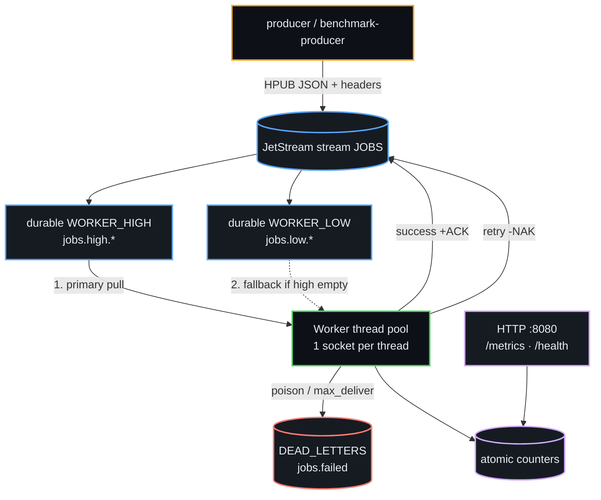

<p align="center">
  
</p>

<p align="center">
  <strong>Ultra-fast, zero-dependency background jobs in Zig + NATS JetStream</strong><br/>
  <sub>At-least-once delivery · Priority queues · Retries · DLQ · Metrics · K8s-ready</sub>
</p>

<p align="center">
  <a href="https://github.com/amafjarkasi/tachyon/actions/workflows/ci.yml"></a>
  <a href="https://github.com/amafjarkasi/tachyon/releases/tag/v0.2.0"></a>
  <a href="https://ziglang.org/"></a>
  <a href="https://docs.nats.io/nats-concepts/jetstream"></a>
  <a href="LICENSE"></a>
  <a href="CHANGELOG.md"></a>
</p>

<p align="center">
  <a href="#-quick-start">Quick Start</a> ·
  <a href="#-features">Features</a> ·
  <a href="#️-architecture">Architecture</a> ·
  <a href="#-configuration">Configuration</a> ·
  <a href="#-production">Production</a> ·
  <a href="#-troubleshooting">Troubleshooting</a>
</p>

---

## What is Tachyon?

**Tachyon** is a production-oriented **background job processor** written in pure **Zig 0.16**, talking to **NATS JetStream** over a hand-rolled TCP/TLS client — **no runtime, no GC, no third-party crates**.

It is built for systems that need:

| Need | How Tachyon delivers |
| :--- | :--- |
| Extreme throughput | ~**99k jobs/sec** consume, ~**72k/sec** produce (local loopback benchmarks) |
| Tiny memory | **&lt; 5 MB** peak under full load; flat arena reuse |
| Reliable delivery | Explicit ACK, **NAK + exponential backoff**, `max_deliver`, **JetStream DLQ** |
| Ops-ready | `/health`, Prometheus `/metrics`, SIGINT/SIGTERM drain, structured JSON logs |
| Flexible deploy | CLI · env · `config.json` · Docker · systemd · Kubernetes |

> **v0.2.0** adds HMSG headers, real delivery-count retries, soft job timeouts, in-process dedup, circuit breaker, buffered batch ACK, and an auto-created `DEAD_LETTERS` stream.

---

## Why Tachyon?

```text
┌──────────────────┬────────────────────────────────────────────────────────┐
│ Zig edge         │ Deterministic native code, no GC pauses, full control  │
│ NATS JetStream   │ Durable streams, pull consumers, priority subjects     │
│ Socket isolation │ One NATS connection per worker thread — zero locks     │
│ Arena reuse      │ arena.reset(.retain_capacity) on the hot path          │
│ Zero deps        │ Only the Zig standard library                          │
└──────────────────┴────────────────────────────────────────────────────────┘
```

Compared to typical stacks:

| Metric | **Tachyon** | Rust (tokio-nats) | Go (nats.go) | Node (BullMQ) | Python (Celery) |
| :--- | :---: | :---: | :---: | :---: | :---: |
| Max ingest | **71.6k/s** | ~28k/s | ~21k/s | ~7.5k/s | ~1.8k/s |
| Max consume | **98.8k/s** | ~86k/s | ~65k/s | ~8k/s | ~2k/s |
| Idle RAM | **&lt; 1 MB** | ~4 MB | ~15 MB | ~74 MB | ~110 MB |
| Peak RAM | **&lt; 5 MB** | ~12 MB | ~48 MB | ~98 MB | ~145 MB |
| External deps | **None** | Tokio/Serde… | std | Redis | RabbitMQ + Celery |

*Numbers from local loopback stress tests (500k messages). Your hardware and job handlers will dominate production latency.*

---

## Table of Contents

- [Quick Start](#-quick-start)
- [Features](#-features)
- [Architecture](#️-architecture)
- [Binaries](#-binaries)
- [Configuration](#-configuration)
- [Job payload &amp; handler](#-job-payload--handler)
- [Observability](#-observability)
- [Resilience model](#-resilience-model)
- [Use cases](#-use-cases)
- [Production](#-production)
- [Troubleshooting](#-troubleshooting)
- [Project layout](#-project-layout)
- [Contributing](#-contributing)
- [Changelog](#-changelog)
- [License](#-license)

---

## 🚀 Quick Start

### Prerequisites

- [Zig 0.16.0](https://ziglang.org/download/)
- [NATS Server](https://docs.nats.io/running-a-nats-service/introduction/installation) with JetStream (`nats-server -js`)

### 1. Start NATS

```bash
nats-server -js
```

### 2. Build

```bash
git clone https://github.com/amafjarkasi/tachyon.git
cd tachyon
zig build -Doptimize=ReleaseFast
```

Binaries land in `zig-out/bin/` (`worker`, `producer`, `benchmark-producer`).

### 3. Run a worker

```bash
# optional: copy and edit config
cp config.json.example config.json

zig build run-worker -Doptimize=ReleaseFast -- --threads 4 --batch 100
```

### 4. Enqueue work

```bash
# single demo job
zig build run-producer

# or flood for a throughput check
zig build run-benchmark-producer -Doptimize=ReleaseFast -- --jobs 50000
```

### 5. Probe health & metrics

```bash
curl -s http://127.0.0.1:8080/health
curl -s http://127.0.0.1:8080/metrics
```

```prometheus
# HELP zig_jobs_processed_total Total number of jobs processed.
# TYPE zig_jobs_processed_total counter
zig_jobs_processed_total 50000
# HELP zig_jobs_failed_total Total number of jobs failed / dead-lettered.
# TYPE zig_jobs_failed_total counter
zig_jobs_failed_total 0
```

---

## ✨ Features

### Core runtime

| Feature | Detail |
| :--- | :--- |
| **Per-thread NATS sockets** | No shared connection, no mutex on the hot path |
| **Elastic auto-scaling** | Spawns up to 8 threads when throughput &gt; 30k/s; drains when &lt; 5k/s |
| **Arena reuse** | `ArenaAllocator` + `reset(.retain_capacity)` — flat memory |
| **Adaptive batching** | Shrinks pull batch when avg latency &gt; 200 ms; grows when &lt; 50 ms |
| **Priority routing** | Pull `WORKER_HIGH` first; fall back to `WORKER_LOW` when empty |
| **Hierarchical config** | CLI → env → `config.json` → defaults |

### Reliability (v0.2)

| Feature | Detail |
| :--- | :--- |
| **HMSG / HPUB headers** | Full NATS header frames; `Nats-Delivery-Count` for real attempt # |
| **NAK + exponential backoff** | `-NAK {"delay":…}` with `retry_base_ms` / `retry_max_ms` |
| **`max_deliver`** | Consumer redelivery cap; then DLQ + `+TERM` |
| **Soft job timeout** | `job_timeout_ms` — NACK if wall clock exceeded |
| **In-progress ACK** | `+WPI` extends JetStream `ack_wait` during work |
| **Job dedup** | Per-thread `job.id` cache (`dedup_cache_size`) |
| **Circuit breaker** | Opens after consecutive failures; half-open probe |
| **Buffered batch ACK** | `ackBuffered` + single `flushWrites` per pull batch |
| **JetStream DLQ** | Auto-creates `DEAD_LETTERS` stream on `jobs.failed` |
| **Reconnect + jitter** | Exponential backoff with ±25% jitter (no thundering herd) |

### Operations

| Feature | Detail |
| :--- | :--- |
| **`/health`** | Kubernetes liveness/readiness (`ok`) |
| **`/metrics`** | Prometheus counters (processed + failed) |
| **Structured JSON logs** | `{"level","thread_id","message"}` |
| **SLA alerts** | `warn` when a single job exceeds 500 ms |
| **Graceful shutdown** | Windows Ctrl+C · POSIX `SIGINT`/`SIGTERM` |
| **TLS + auth** | `std.crypto.tls.Client`, CONNECT user/pass |
| **Docker** | Multi-stage `Dockerfile`, non-root runtime |

### Feature deep-dives

<details>
<summary><strong>1. Socket-isolated workers</strong></summary>

Each OS thread owns a dedicated `NatsClient` and TCP (or TLS) connection. Pull, process, and ACK never contend on a shared socket mutex — throughput scales with cores until NATS or the job handler saturates.

</details>

<details>
<summary><strong>2. Priority queues</strong></summary>

Two durable pull consumers:

- `WORKER_HIGH` → `jobs.high.*`
- `WORKER_LOW` → `jobs.low.*`

Every loop iteration requests high first; only on empty/status does it pull low. Stream and consumer names are fully configurable.

</details>

<details>
<summary><strong>3. Retry &amp; dead letter</strong></summary>

```text
parse fail  ──► publish DLQ ──► +TERM
handler fail ──► if attempt < max_deliver ──► -NAK (backoff)
              └► else ──► publish DLQ ──► +TERM
success     ──► +ACK  (+ optional batch flush)
```

Backoff: `min(base_ms × 2^(attempt-1), max_ms)` converted to nanoseconds for JetStream.

</details>

<details>
<summary><strong>4. Headers (HMSG)</strong></summary>

`readMsg` understands both classic `MSG` and header-bearing `HMSG`. Status frames (`NATS/1.0 404 No Messages`) set `Msg.is_status`. Producers can attach headers via `publishWithHeaders` (e.g. `Nats-Msg-Id` for broker-side dedup).

</details>

<details>
<summary><strong>5. Circuit breaker</strong></summary>

After `circuit_failure_threshold` consecutive failures the worker **opens**: new jobs are NACKed without invoking the handler for `circuit_open_ms`, then **half-open** probes a single job. Success closes the circuit.

</details>

---

## 🏗️ Architecture



### Hot path (per job)

1. `requestNext` pull batch from high (then low) consumer  
2. `readMsg` → parse `MSG`/`HMSG`, extract `delivery_count`  
3. Circuit check → JSON parse → dedup by `job.id`  
4. `+WPI` → `processJob` (your domain logic)  
5. Success → buffered `+ACK` · Failure → `-NAK` or DLQ + `+TERM`  
6. Batch end → `flushWrites` · adaptive batch size update  

---

## 📦 Binaries

| Binary | Command | Role |
| :--- | :--- | :--- |
| **worker** | `zig build run-worker -- [flags]` | Production consumer pool |
| **producer** | `zig build run-producer` | Single-job enqueuer (HPUB + `Nats-Msg-Id`) |
| **benchmark-producer** | `zig build run-benchmark-producer -- --jobs N` | Stress publisher (80% high / 20% low) |

```bash
worker --help
#  -t, --threads <n>   concurrent workers (default 4)
#  -b, --batch <n>     pull batch size   (default 50)
#  -h, --help
```

---

## ⚙️ Configuration

**Precedence (highest wins):**

```text
CLI flags  >  environment variables  >  config.json  >  built-in defaults
```

### `config.json`

Copy [`config.json.example`](config.json.example):

```json
{
    "nats_host": "127.0.0.1",
    "nats_port": 4222,
    "nats_user": null,
    "nats_pass": null,
    "nats_tls": false,
    "nats_ca_path": null,
    "worker_threads": 4,
    "worker_batch": 100,
    "stream_name": "JOBS",
    "consumer_high": "WORKER_HIGH",
    "consumer_low": "WORKER_LOW",
    "subject_high": "jobs.high.*",
    "subject_low": "jobs.low.*",
    "dlq_subject": "jobs.failed",
    "dlq_stream": "DEAD_LETTERS",
    "max_deliver": 5,
    "retry_base_ms": 1000,
    "retry_max_ms": 30000,
    "job_ttl_seconds": 0,
    "max_jobs_per_second": 0,
    "job_timeout_ms": 5000,
    "dedup_cache_size": 10000,
    "circuit_failure_threshold": 10,
    "circuit_open_ms": 5000,
    "batch_ack": true
}
```

### Field reference

| Field | Default | Description |
| :--- | :--- | :--- |
| `nats_host` / `nats_port` | `127.0.0.1` / `4222` | Broker address |
| `nats_user` / `nats_pass` | `null` | CONNECT authentication |
| `nats_tls` / `nats_ca_path` | `false` / `null` | TLS + optional CA bundle |
| `worker_threads` | `4` | Initial pool size (auto-scale ceiling 8) |
| `worker_batch` | `50` | Max pull batch (adaptive under load) |
| `stream_name` | `JOBS` | JetStream stream |
| `consumer_high` / `consumer_low` | `WORKER_HIGH` / `WORKER_LOW` | Durable names |
| `subject_high` / `subject_low` | `jobs.high.*` / `jobs.low.*` | Filters |
| `dlq_subject` / `dlq_stream` | `jobs.failed` / `DEAD_LETTERS` | Dead-letter routing |
| `max_deliver` | `5` | Redelivery cap |
| `retry_base_ms` / `retry_max_ms` | `1000` / `30000` | NAK backoff range |
| `job_ttl_seconds` | `0` | Stream `max_age` (`0` = none) |
| `max_jobs_per_second` | `0` | Per-worker rate cap (`0` = unlimited) |
| `job_timeout_ms` | `5000` | Soft wall-clock timeout (`0` = off) |
| `dedup_cache_size` | `10000` | Max remembered `job.id`s per thread |
| `circuit_failure_threshold` | `10` | Failures before open |
| `circuit_open_ms` | `5000` | Open duration |
| `batch_ack` | `true` | Buffer ACKs; flush once per batch |

### Environment overrides

| Variable | Maps to |
| :--- | :--- |
| `NATS_HOST` `NATS_PORT` `NATS_USER` `NATS_PASS` `NATS_TLS` `NATS_CA` | Connection |
| `STREAM_NAME` `CONSUMER_HIGH` `CONSUMER_LOW` | Stream / consumers |
| `SUBJECT_HIGH` `SUBJECT_LOW` `DLQ_SUBJECT` `DLQ_STREAM` | Subjects |
| `MAX_DELIVER` `JOB_TTL_SECONDS` `MAX_JOBS_PER_SECOND` `JOB_TIMEOUT_MS` | Runtime limits |

```bash
NATS_HOST=nats.prod.internal NATS_TLS=true \
  STREAM_NAME=ORDERS MAX_DELIVER=8 \
  zig-out/bin/worker --threads 8 --batch 200
```

---

## 🧩 Job payload & handler

Default JSON shape (producer + worker):

```json
{
  "id": "job_12345",
  "email": "hello@example.com",
  "subject": "Welcome",
  "body": "…"
}
```

Hook your domain logic in `processJob` inside [`src/worker.zig`](src/worker.zig):

```zig
fn processJob(job: Job, thread_id: usize, timeout_ms: u32, io: std.Io, progress: ?*const fn () void) !void {
    // send email · call HTTP API · write to DB · …
    _ = .{ job, thread_id, timeout_ms, io, progress };
}
```

| Outcome | Worker action |
| :--- | :--- |
| Return success | `+ACK` (buffered if `batch_ack`) |
| Return error / timeout | `-NAK` with backoff, or DLQ + `+TERM` if `delivery_count ≥ max_deliver` |
| Invalid JSON | DLQ + `+TERM` (poison — never retry) |
| Duplicate `job.id` | `+ACK` without re-running handler |

---

## 📡 Observability

### HTTP endpoints (`127.0.0.1:8080`)

| Path | Response |
| :--- | :--- |
| `GET /health` | `200` + `ok` — liveness/readiness |
| `GET /metrics` | Prometheus text (processed + failed counters) |
| other | `404 not found` |

### Structured logs

```json
{"level":"info","thread_id":2,"message":"Processing job id=job_1 to=a@b.com subject=Welcome"}
{"level":"warn","thread_id":1,"message":"Job SLA violated: 823ms execution time"}
{"level":"warn","message":"Shutdown signal received. Draining workers gracefully..."}
```

### Graceful shutdown

| Platform | Signals |
| :--- | :--- |
| Windows | `Ctrl+C` / `Ctrl+Break` via `SetConsoleCtrlHandler` |
| Linux / macOS | `SIGINT`, `SIGTERM` via `std.posix.sigaction` |

Workers finish the in-flight job, stop pulling, and exit. Metrics server drains with them.

---

## 🛡️ Resilience model

```text
                    ┌──────────────┐
   pull ──────────► │   worker     │
                    │              │── parse fail ──────────► DLQ + TERM
                    │  circuit?    │
                    │  dedup?      │── handler fail ─┬─ attempt < max ──► NAK + delay
                    │  timeout?    │                 └─ attempt ≥ max ──► DLQ + TERM
                    │  processJob  │
                    └──────┬───────┘
                           │ ok
                           ▼
                         +ACK
```

| Mechanism | Purpose |
| :--- | :--- |
| Explicit ACK | No message lost on crash mid-batch (unacked redeliver) |
| NAK delay | Space out retries; avoid hot-loop poison |
| `max_deliver` | Bound retry cost |
| DLQ stream | Inspect / replay failed work |
| Circuit breaker | Protect downstream when it is down |
| Soft timeout | Surface stuck handlers (pair with JetStream `ack_wait`) |
| Dedup cache | Soft exactly-once for handlers keyed by `job.id` |
| Reconnect jitter | Survive broker blips without herd reconnect |

---

## 💡 Use cases

Tachyon fits any **pull-based, durable, multi-worker** pipeline:

| Domain | Pattern |
| :--- | :--- |
| **Transactional email** | High-priority password resets; low-priority digests |
| **Fintech clearing** | Settlement jobs with strict retries + DLQ audit |
| **Media pipelines** | Thumbnail / transcode workers with rate limits |
| **Crawlers** | URL frontier on `jobs.low.*`, scrape on high for VIP hosts |
| **Push notifications** | Device fan-out with circuit breaker around FCM/APNs |
| **Log / telemetry** | Ingest bursts; auto-scale thread pool |

Minimal producer sketch:

```zig
const job = .{
    .id = "evt_99012a",
    .email = "billing@company.com",
    .subject = "Invoice Settled",
    .body = "Payment of $499.00 processed.",
};
// serialize JSON, then:
try client.publishWithHeaders(
    "jobs.high.billing",
    null,
    &[_][]const u8{"Nats-Msg-Id: evt_99012a"},
    payload,
);
```

---

## 🏭 Production

### Docker

```bash
docker build -t tachyon:0.2.0 .
docker run --rm -e NATS_HOST=nats -p 8080:8080 tachyon:0.2.0
```

Multi-stage image: Zig build → slim Debian runtime, non-root user, port `8080` exposed. See [`Dockerfile`](Dockerfile).

### Kubernetes (sketch)

```yaml
livenessProbe:
  httpGet: { path: /health, port: 8080 }
  initialDelaySeconds: 5
readinessProbe:
  httpGet: { path: /health, port: 8080 }
env:
  - { name: NATS_HOST, value: nats.default.svc.cluster.local }
  - { name: NATS_TLS,  value: "true" }
lifecycle:
  preStop:
    exec:
      command: ["sleep", "5"]   # allow SIGTERM drain
```

### systemd

```ini
[Service]
ExecStart=/usr/local/bin/worker --threads 4 --batch 100
Environment=NATS_HOST=127.0.0.1
Restart=on-failure
KillSignal=SIGTERM
TimeoutStopSec=30
```

### NATS HA

Run a 3/5-node JetStream cluster; point all workers at a load-balanced `NATS_HOST`. Streams and durable consumers are created idempotently on worker startup.

---

## 🔧 Troubleshooting

| Symptom | Fix |
| :--- | :--- |
| Connection refused `:4222` | Start `nats-server -js`; check host/port/firewall |
| `JetStream not enabled` | Restart NATS with `-js` or JetStream block in config |
| TLS handshake fails | Verify `nats_tls`, CA path, and cert SAN vs `nats_host` |
| Workers never scale up | Auto-scale needs **&gt; 30k jobs/sec**; load with `benchmark-producer` |
| Port 8080 in use | Metrics bind fails silently — free the port or change the bind in `worker.zig` |
| Jobs redeliver forever | Check `max_deliver`; poison JSON should DLQ+TERM, not loop |
| Shutdown kills mid-job on Linux | Ensure you run a build with POSIX `sigaction` (v0.2+); prefer `SIGTERM` over `SIGKILL` |
| DLQ empty | Confirm stream `DEAD_LETTERS` exists (`nats stream ls`); worker creates it on boot |
| Windows CI `zig fmt` noise | Repo enforces LF via `.gitattributes`; always `zig fmt src/` before commit |

```bash
# useful NATS CLI checks
nats server check connection
nats stream ls
nats consumer ls JOBS
nats stream view DEAD_LETTERS
```

---

## 📁 Project layout

```text
tachyon/
├── src/
│   ├── worker.zig              # pool, retry, health, metrics, processJob
│   ├── nats_client.zig         # raw NATS/JetStream TCP+TLS client
│   ├── producer.zig            # single-job HPUB enqueuer
│   ├── benchmark_producer.zig  # load generator
│   └── tests.zig               # pure unit tests (zig build test)
├── config.json.example
├── build.zig / build.zig.zon
├── Dockerfile
├── logo.png                    # icon (avatar)
├── logo-banner.png             # README hero
├── logo_v4.png                 # legacy mark
├── CHANGELOG.md
├── CONTRIBUTING.md
├── SECURITY.md
└── LICENSE
```

---

## 🤝 Contributing

See [CONTRIBUTING.md](CONTRIBUTING.md) for setup, style, and PR expectations.  
Security issues: [SECURITY.md](SECURITY.md) — please **do not** open a public issue for vulns.

```bash
zig fmt --check src/
zig build test
zig build
zig build -Doptimize=ReleaseFast
```

---

## 📝 Changelog

All notable changes: **[CHANGELOG.md](CHANGELOG.md)**  
Latest release: **[v0.2.0](https://github.com/amafjarkasi/tachyon/releases/tag/v0.2.0)**

---

## 📄 License

[MIT](LICENSE) © 2026 Tachyon Authors

---

<p align="center">
  <br/>
  <sub>Built with Zig · Powered by NATS JetStream · Designed for production speed</sub>
</p>
