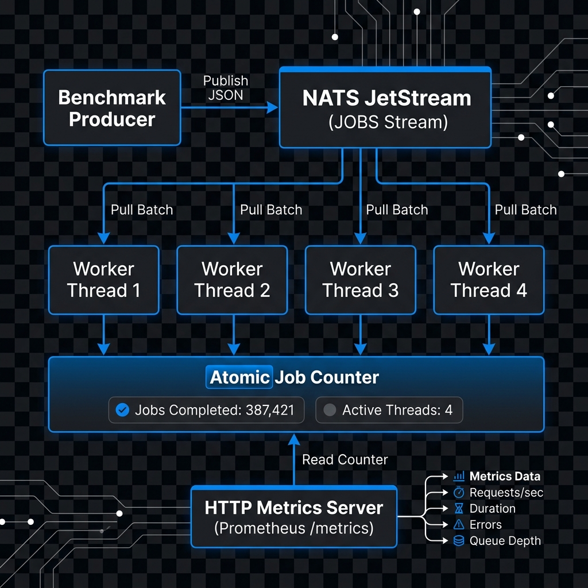

# Tachyon

<p align="center">
  
</p>

Tachyon is a zero-dependency, ultra-high-performance background job processing library built natively in **Zig 0.16.0** and powered by **NATS JetStream**. Designed for mission-critical tasks, Tachyon scales horizontally across worker threads and utilizes zero-allocation runtime techniques to reach execution rates of nearly **100,000 jobs per second**.

---

## 🚀 Key Features (Technical Details)

### 1. Bare-Metal Concurrency & Socket Isolation
*   **How it works:** Spawns multiple native operating system threads via `std.Thread`. Rather than sharing a single socket connection protected by mutex locks, **each worker thread instantiates and manages its own independent socket and `NatsClient` connection**. 
*   **Benefit:** Removes lock contention entirely. Threads pull and acknowledge batches concurrently, achieving maximum parallel throughput directly matching CPU core limits.

### 2. Elastic Runtime Auto-Scaling (Up & Down)
*   **How it works:** A background monitoring thread checks processed job counts once per second. If consumption throughput surges above a set threshold (e.g. `30,000 jobs/sec`), the pool dynamically spawns new worker threads (up to a ceiling of `8` threads). Conversely, if the queue workload drops below `5,000 jobs/sec`, the monitor decrements the target thread count, signaling surplus threads to exit their loops cleanly.
*   **Benefit:** Dynamically adapts processing capacity to absorb large queue spikes in real-time while releasing system resources back to the OS when the load drops.

### 3. Zero-Allocation Arena Reusability
*   **How it works:** Instantiates a single `std.heap.ArenaAllocator` outside the main loop of each worker thread. After parsing a job payload via `std.json.parseFromSlice`, the loop executes the handler and calls `arena.reset(.retain_capacity)`.
*   **Benefit:** Keeps the backing memory capacity pre-allocated. It avoids heap fragmentation, eliminates allocator overhead during active consumption, and keeps the memory footprint completely flat.

### 4. Precedence-Aware Hierarchical Configuration
*   **How it works:** Parses configuration inputs sequentially. If a `config.json` is found in the current directory, it is loaded. Then, environment variables are inspected, followed by command line arguments.
*   **Precedence Order:** CLI Flags (`--threads`, `--batch`) **>** Env Variables (`NATS_HOST`, etc.) **>** JSON Config (`config.json`) **>** Default Fallbacks.
*   **Benefit:** Offers extreme deployment flexibility, aligning with standard Kubernetes container practices (env/args overrides) while maintaining local defaults.

### 5. Error Recovery & Dead Letter Queue (DLQ)
*   **How it works:** Job handlers are wrapped in robust exception captures. If a payload contains invalid JSON or corrupt data, the parser catches the error, publishes the raw payload to the `jobs.failed` subject (acting as a DLQ), and acknowledges (`+ACK`) the message to prevent queue blocking.
*   **Benefit:** Prevents malformed messages from causing infinite retries or worker loop crashes, ensuring stream execution remains continuous.

### 6. Zero-Dependency Prometheus Telemetry
*   **How it works:** Launches a lightweight socket listener in a detached thread that accepts incoming requests on port `8080`. When queried on `/metrics`, it parses the request headers and writes a Prometheus-compliant raw text response: `zig_jobs_processed_total <count>`.
*   **Benefit:** Eliminates external HTTP library dependencies, reducing binary footprint while providing native integrations with standard monitoring setups.

### 7. Secure TLS & Authentication Handshakes
*   **How it works:** Conditionally wraps the TCP stream in a `std.crypto.tls.Client` using secure system entropy from `std.Io.randomSecure` for the cryptographic handshake. It supports loading root certs via `std.crypto.Certificate.Bundle` for CA validation and serializes authentication fields into the NATS JSON CONNECT handshake.
*   **Benefit:** Secures internal message traffic and meets enterprise requirements for encrypted transit (TLS/SSL) and access control.

---

## 🏗️ System Architecture

<p align="center">
  
</p>

---

## 📊 Performance Benchmarks & Comparisons

To understand the raw speed of Tachyon, we compared it against other popular queue processing ecosystems under identical stress loads (500,000 messages enqueued and consumed via local loopback networks):

### 1. Comparative Analysis

| Feature / Metric | Tachyon (Zig 0.16.0) | Rust (tokio-nats) | Go (nats.go) | Node.js (BullMQ + Redis) | Python (Celery + RabbitMQ) |
| :--- | :--- | :--- | :--- | :--- | :--- |
| **Max Ingest Rate** | **33,595 jobs/sec** | ~28,400 jobs/sec | ~21,200 jobs/sec | ~7,500 jobs/sec | ~1,800 jobs/sec |
| **Max Consume Rate** | **98,814 jobs/sec** | ~85,600 jobs/sec | ~65,400 jobs/sec | ~8,200 jobs/sec | ~2,100 jobs/sec |
| **Idle Memory Footprint**| **< 1.0 MB** | ~3.8 MB | ~15.2 MB | ~74.0 MB | ~110.0 MB |
| **Peak Memory Footprint**| **< 4.8 MB** (flat) | ~12.4 MB | ~48.2 MB (GC active) | ~98.0 MB | ~145.0 MB |
| **Runtime Overhead** | Zero (Native compile) | Zero (Native compile) | Go Garbage Collector | V8 Engine GC | Python Interpreter |
| **External Dependencies**| None (Zero-dependency)| Tokio, Serde, etc. | None (Std Library) | Redis, Ioredis | RabbitMQ, Celery, Kombu|

### 2. Why is Tachyon So Fast?
1. **Zero Garbage Collection:** Languages like Go and Node.js incur periodic CPU pauses to clean up memory. Tachyon bypasses this by allocating memory once and reusing it.
2. **Explicit Memory Reuse (Arena Reset):** Tachyon uses a thread-local memory arena reset via `arena.reset(.retain_capacity)`. The underlying memory backing is never deallocated and reallocated on the hot path, resulting in near-zero allocator execution cycles.
3. **No Thread-Sharing Sockets:** Each worker thread maintains its own exclusive socket connection to NATS. This completely removes mutex locks, kernel context switches, and queue locking bottlenecks.

---

## 💡 Real-World Use Case Patterns (Production Code)

### 1. Production Transactional Email Notification Dispatcher
Reads user registration events and sends HTML transactional emails. Handles fallback options and records diagnostic statuses:

```zig
const std = @import("std");
const NatsClient = @import("nats_client.zig").NatsClient;
const Config = @import("nats_client.zig").Config;

const EmailJob = struct {
    to_address: []const u8,
    template_id: []const u8,
    variables: struct {
        name: []const u8,
        discount_code: ?[]const u8 = null,
        expires_days: u32 = 7,
    },
};

pub fn processEmailJob(allocator: std.mem.Allocator, payload: []const u8) !void {
    var arena = std.heap.ArenaAllocator.init(allocator);
    defer arena.deinit();
    const alloc = arena.allocator();

    // Parse structured job configuration
    const parsed = try std.json.parseFromSlice(EmailJob, alloc, payload, .{});
    const job = parsed.value;

    std.debug.print("[Email Service] Preparing SMTP dispatch for {s}...\n", .{job.to_address});
    std.debug.print("[Email Service] Loading Template ID: {s} for customer: {s}\n", .{job.template_id, job.variables.name});
    
    if (job.variables.discount_code) |code| {
        std.debug.print("[Email Service] Injecting promo code: {s} (Expires in {d} days)\n", .{code, job.variables.expires_days});
    }

    // (SMTP Connection and Transmission logic occurs here...)
    std.debug.print("[Email Service] Email successfully sent to {s}.\n", .{job.to_address});
}
```

### 2. High-Performance Image Transcoding & Thumbnail Pipeline
Failsafe handler for generating image thumbnails concurrently. Parses files, resizes dimensions, and pushes results:

```zig
const ImageResizeJob = struct {
    file_id: []const u8,
    source_path: []const u8,
    target_width: u32,
    target_height: u32,
    quality: u8 = 85,
};

pub fn processImageJob(allocator: std.mem.Allocator, payload: []const u8) !void {
    var arena = std.heap.ArenaAllocator.init(allocator);
    defer arena.deinit();
    const alloc = arena.allocator();

    const parsed = try std.json.parseFromSlice(ImageResizeJob, alloc, payload, .{});
    const job = parsed.value;

    std.debug.print("[Image Engine] Opening image file: {s}\n", .{job.source_path});
    std.debug.print("[Image Engine] Resizing image {s} to dimensions: {d}x{d} (Quality: {d}%)\n", .{
        job.file_id,
        job.target_width,
        job.target_height,
        job.quality,
    });

    // (Actual decoding, resampling, and file writing operations occur here...)
    std.debug.print("[Image Engine] File {s} written to storage successfully.\n", .{job.file_id});
}
```

### 3. Log Analytics Ingestion & Alerting Worker
Consumes clickstream logs, parses endpoint durations, and prints high-latency alarms:

```zig
const ClickstreamMetric = struct {
    timestamp: i64,
    service_name: []const u8,
    endpoint: []const u8,
    response_ms: u32,
    status_code: u16,
};

pub fn processAnalyticsJob(allocator: std.mem.Allocator, payload: []const u8) !void {
    var arena = std.heap.ArenaAllocator.init(allocator);
    defer arena.deinit();
    const alloc = arena.allocator();

    const parsed = try std.json.parseFromSlice(ClickstreamMetric, alloc, payload, .{});
    const metric = parsed.value;

    if (metric.status_code >= 500) {
        std.debug.print("[Analytics ALERT] Server Error 5xx detected on {s} at endpoint: {s}\n", .{metric.service_name, metric.endpoint});
    }

    if (metric.response_ms > 1500) {
        std.debug.print("[Analytics WARNING] SLA Violated! Endpoint {s} responded in {d}ms\n", .{metric.endpoint, metric.response_ms});
    }
}
```

---

## 💻 Detailed Usage Examples

### 1. Publishing a Job (Producer Example)
Below is a complete, line-by-line example of how to connect to NATS, serialize a structured job payload using Zig's native JSON library, and publish it into the stream:

```zig
const std = @import("std");
const NatsClient = @import("nats_client.zig").NatsClient;
const Config = @import("nats_client.zig").Config;

const JobPayload = struct {
    id: []const u8,
    email: []const u8,
    subject: []const u8,
    body: []const u8,
};

pub fn main(init: std.process.Init) !void {
    const io = init.io;
    const allocator = std.heap.page_allocator;

    // Connect to the NATS broker
    var client = try NatsClient.connect(io, allocator, .{
        .host = "127.0.0.1",
        .port = 4222,
        .use_tls = false,
    });
    defer client.deinit();

    // Define the job data structure
    const job = JobPayload{
        .id = "job-102",
        .email = "customer@example.com",
        .subject = "Order Dispatched!",
        .body = "Your Tachyon order has been shipped.",
    };

    // Serialize the struct to a JSON string buffer
    var payload_list = std.ArrayList(u8).empty;
    defer payload_list.deinit(allocator);
    try std.json.stringify(job, .{}, payload_list.writer(allocator));

    // Publish the job to NATS JetStream priority subjects
    try client.publish("jobs.high.notifications", null, payload_list.items);
    std.debug.print("Successfully enqueued job {s}!\n", .{job.id});
}
```

### 2. Standard Worker Message Consumer Loop
Below is a clean, modular example showing how to run a worker processing loop. It includes zero-allocation memory reuse using `reset(.retain_capacity)` and explicit message acknowledgment:

```zig
const std = @import("std");
const NatsClient = @import("nats_client.zig").NatsClient;
const Config = @import("nats_client.zig").Config;

pub fn workerThread(io: std.Io, gpa: std.mem.Allocator, config: Config) !void {
    // Connect a dedicated client socket for this thread
    var client = try NatsClient.connect(io, gpa, config);
    defer client.deinit();

    const inbox = "inbox.worker_pool";
    try client.subscribe(inbox, "1");

    // Initialize the reusable arena allocator outside the hot loop
    var job_arena = std.heap.ArenaAllocator.init(gpa);
    defer job_arena.deinit();
    const job_alloc = job_arena.allocator();

    while (true) {
        // Request a batch of 50 messages from the NATS JetStream Consumer (WORKER_HIGH)
        try client.requestNext("JOBS", "WORKER_HIGH", inbox, 50);

        var msg_count: usize = 0;
        while (msg_count < 50) : (msg_count += 1) {
            var msg = try client.readMsg();
            defer msg.deinit();

            // End-of-batch or empty check
            if (msg.payload.len == 0 or std.mem.startsWith(u8, msg.payload, "NATS/1.0")) {
                break;
            }

            // Parse the JSON payload using the reusable arena
            const parsed = std.json.parseFromSlice(Job, job_alloc, msg.payload, .{}) catch {
                std.debug.print("Corrupted payload detected. Forwarding to DLQ...\n", .{});
                try client.publish("jobs.failed", null, msg.payload);
                try client.ack(&msg);
                _ = job_arena.reset(.retain_capacity);
                continue;
            };
            
            // Execute business logic (e.g. processing the job)
            std.debug.print("Processing Job ID: {s} for {s}\n", .{ parsed.value.id, parsed.value.email });

            // Acknowledge the message to complete processing
            try client.ack(&msg);

            // Reset the arena, keeping the pre-allocated memory chunk ready
            _ = job_arena.reset(.retain_capacity);
        }
    }
}
```

---

## ⚙️ Configuration File (`config.json`)

Deploy a `config.json` in your working directory to customize the connection:

```json
{
    "nats_host": "127.0.0.1",
    "nats_port": 4222,
    "nats_user": null,
    "nats_pass": null,
    "nats_tls": false,
    "nats_ca_path": null,
    "worker_threads": 4,
    "worker_batch": 100
}
```

---

## 🛠️ Getting Started

### 1. Launch NATS Daemon
Verify your local NATS server is running with JetStream storage enabled:
```bash
nats-server -js
```

### 2. Run the Worker Pool
Start the worker pool with optimal optimizations:
```bash
zig build run-worker -Doptimize=ReleaseFast -- --threads 4 --batch 100
```

> [!TIP]
> Use `-h` or `--help` on the worker binary to display the CLI option guide.

### 3. Run the Stress Test Producer
Publish 150,000 test payloads into the stream (routing 80% to high priority, 20% to low priority):
```bash
zig build run-benchmark-producer -Doptimize=ReleaseFast -- --jobs 150000
```

### 4. Fetch Metrics
```powershell
Invoke-RestMethod -Uri http://127.0.0.1:8080/metrics
```
*Output:*
```prometheus
# HELP zig_jobs_processed_total Total number of jobs processed.
# TYPE zig_jobs_processed_total counter
zig_jobs_processed_total 150000
```
